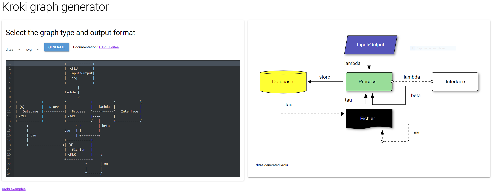

# krokiwiz: A simple kroki graph generator UI





## Requirements

- a working kroki server
- python >= 3.10
- poetry
- docker (optional)

## Installation and running locally

### Installation

Clone this repository :

```shell
git clone https://github.com/ericgarrigues/krokiwiz.git
cd krokiwiz
```

```shell
poetry install krokiwiz
```

### Running

From the root of the cloned repository :

```shell
export KROKI_URL=<MY_KROKI_SERVER_URL>
poetry run ./krokiwiz.py
```

## Docker

### Build image

```shell
./build_docker.sh
```

This will create an image named krokiwiz with the version extracted from the
pyproject.yaml file.

### Running

```shell
docker run --rm --name krokywiz -p 8080:8080 \
-e KROKI_URL=<MY_KROKI_SERVER_URL> krokiwiz:latest
```

You can then access the ui at http://localhost:8080
